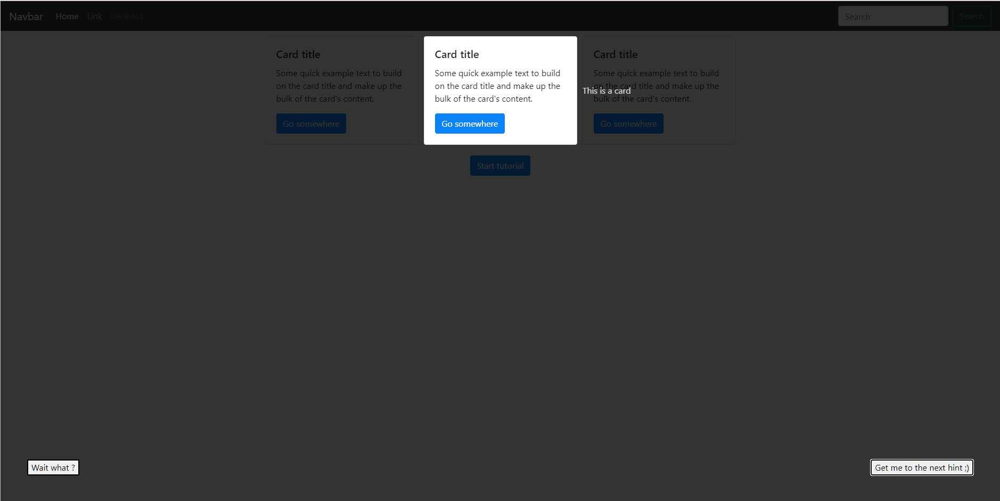

# tutorial.js

Library to easily create tutorials for your web application.

## Demo



You can find a demo in this repository: [demo](./demo).

Please note that you have to build the library before running the demo and run the demo HTML file from a web server. (If you are using VSCode, you can use the [Live Server](https://marketplace.visualstudio.com/items?itemName=ritwickdey.LiveServer) extension.)

## Installation

```bash
# Clone the repository
git clone <url>

# Install dependencies
npm install

# Build the library
npm run build
```

Then import the library in your project:

```javascript
import { Tutorialjs } from '../dist/index.js'
```

## Usage

```javascript
// Create a new tutorial
const tutorial = new Tutorialjs(steps[], options);
tutorial.start();
```

### Steps

The steps are an array of objects. Each object represents a step of the tutorial.

```javascript
export interface Step {
    element: string | HTMLElement;
    comment: string;
    position?: string; // Default: 'bottom'
}
```

### Options

The options are an object with the following properties:

```javascript
export interface Options {
    backgroundColor?: string; // Default: #000000
    textColor?: string; // Default: #FFFFFF
    backgroundOpacity?: number; // Default: 0.5
    textOpacity?: number; // Default: 1
    nextButtonLabel?: string; // Default: Next
    previousButtonLabel?: string; // Default: Previous
};
```

## More

Feel free to contribute to this project by opening issues or pull requests or by giving me feedback.